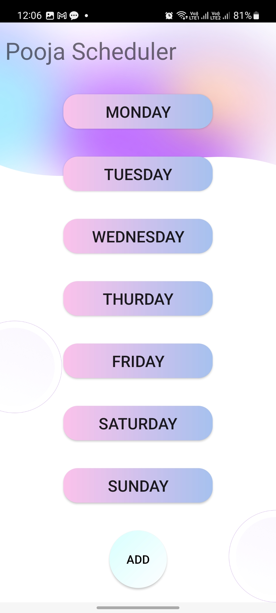

# Pooja-Tracker-App
This app aims to provide a convenient and organized way for individuals to plan and manage their pooja rituals. By integrating YouTube video links and offering tracking features, the app assists users in staying focused and ensuring they complete their pooja rituals according to their schedules without missing out any video/ritual.

  
  
  
  

Key Features:

Pooja Schedule Creation: Users can create their personalized pooja schedules by adding the details of each day, such as the day of the week and the specific rituals to be performed.

Video Link Integration: The app allows users to add YouTube video links related to each specific ritual in their schedule. Users can input the video URLs or video IDs to associate the videos with their respective rituals.

Watched Video Tracking: The Pooja Schedule Manager keeps track of the videos that users have already watched. Once a video is marked as watched, the app provides visual indicators to help users easily identify which videos are remaining to be watched.

// Notification Reminders: The app provides optional notification reminders for each scheduled pooja. Users can set reminders to ensure they don't miss any of their scheduled rituals.

// Offline Support: The app provides offline functionality, allowing users to access their pooja schedules and view watched videos even without an internet connection.

User-Friendly Interface: The app features a user-friendly interface with intuitive navigation and clear visual cues, making it easy for users to manage their pooja schedules and track their progress.

The Pooja Schedule Manager aims to provide a convenient and organized way for individuals to plan and manage their pooja rituals. By integrating YouTube video links and offering tracking features, the app assists users in staying focused and ensuring they complete their pooja rituals according to their schedules.
